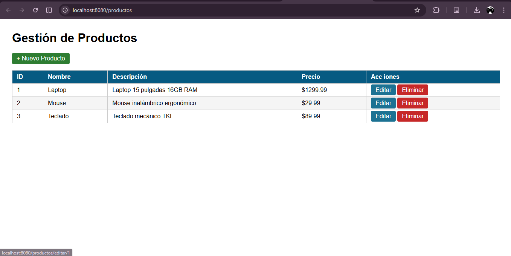
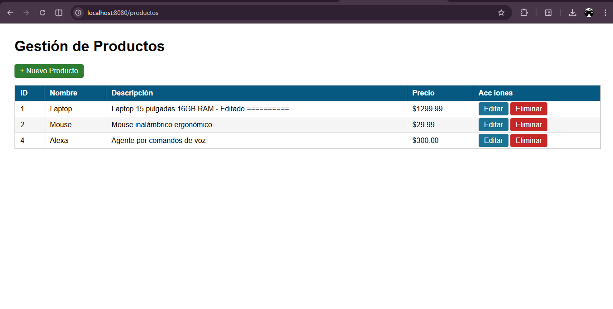
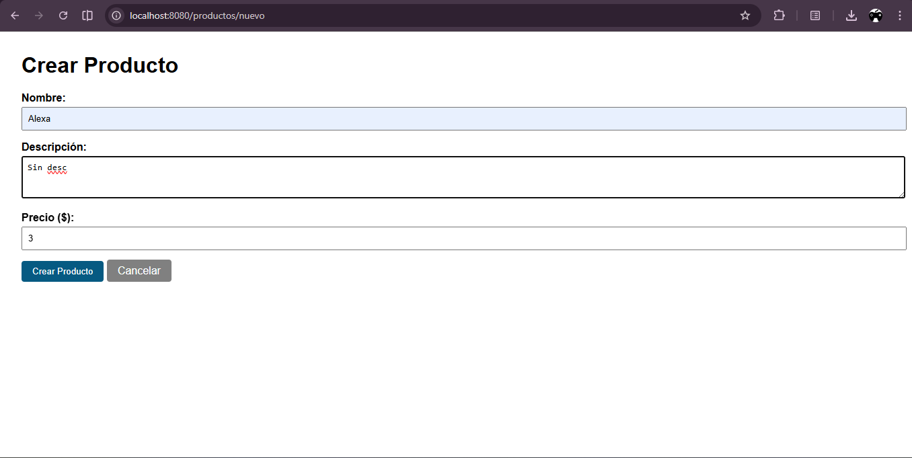
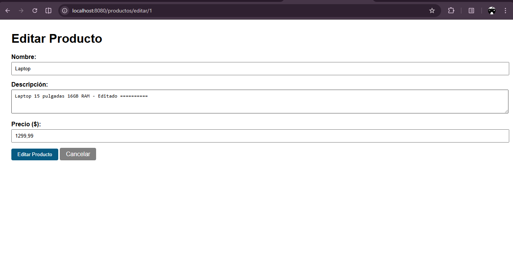

# productos-web

## Descripción del proyecto

Aplicación web desarrollada con Spring Boot que implementa un CRUD completo para la gestión de productos. Utiliza el patrón MVC, Thymeleaf como motor de plantillas y una estructura en memoria para la persistencia de datos. La aplicación permite crear, listar, editar y eliminar productos, siguiendo el patrón Post/Redirect/Get para el manejo de formularios.

---

## Instrucciones de ejecución

### Prerrequisitos

* Java JDK 17 o superior
* Maven 3.8 o superior

### Pasos para ejecutar

1. Clonar el repositorio:

```bash
git clone https://github.com/AndressToscanom30/toscano-post1-u7.git
cd productos-web
```

2. Ejecutar la aplicación:

```bash
mvn spring-boot:run
```

3. Abrir en el navegador:

```text
http://localhost:8080/productos
```

---

## Capturas de pantalla

### Lista de productos
Vista principal de la aplicación donde se listan todos los productos disponibles con sus respectivos datos.

---

### Funcionamiento del CRUD
Esta imagen muestra el funcionamiento completo del sistema CRUD, donde se pueden observar las operaciones de creación, edición y eliminación de productos reflejadas correctamente en la interfaz.

---

### Formulario para agregar producto
Formulario utilizado para registrar un nuevo producto en el sistema, incluyendo nombre, descripción y precio.

---

### Edición de producto
Formulario que muestra la edición de un producto existente, con los campos previamente cargados para su modificación.

---
